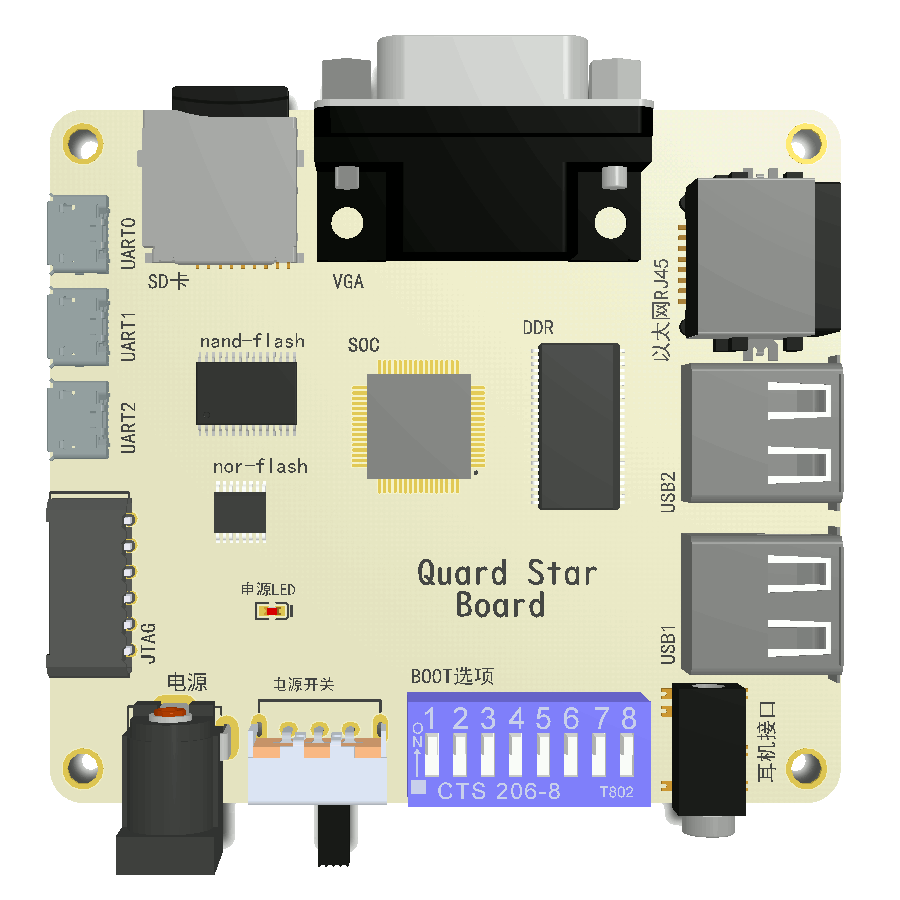
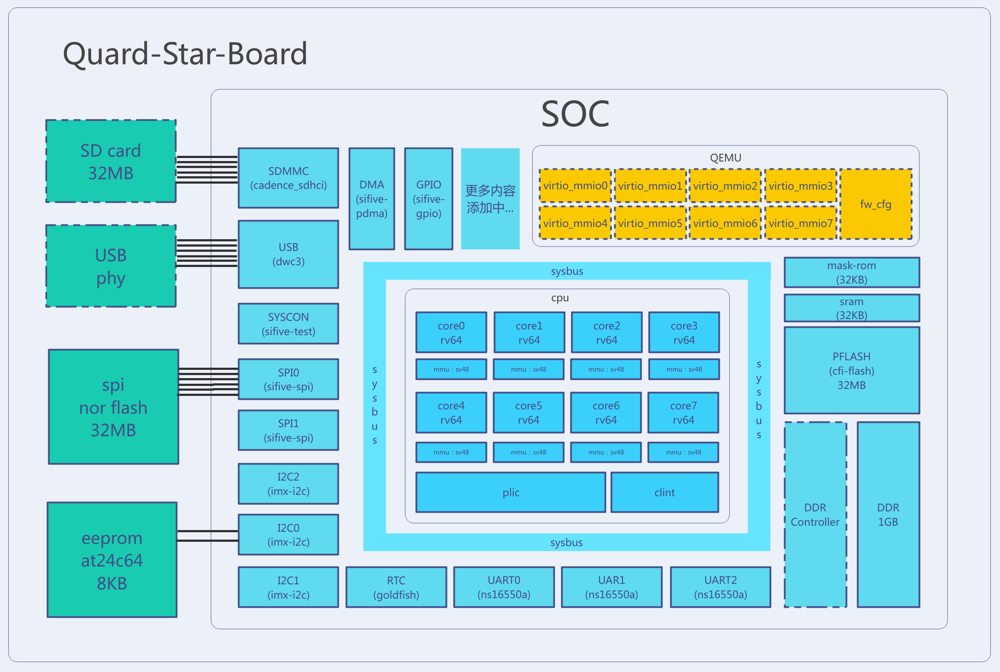
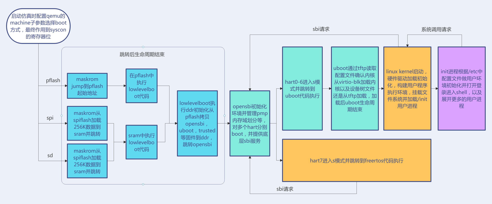
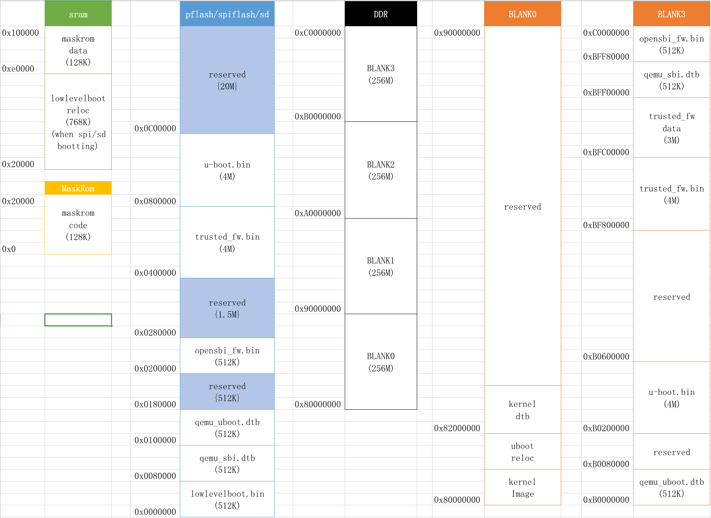

[](https://github.com/QQxiaoming/quard_star_tutorial/actions/workflows/ci.yml)
[](https://quard-star-tutorial.readthedocs.io/zh_CN/latest/?badge=latest)
[](https://www.codefactor.io/repository/github/qqxiaoming/quard_star_tutorial)
[](https://github.com/QQxiaoming/quard_star_tutorial/releases)
[](https://github.com/QQxiaoming/quard_star_tutorial)

# Construction of embedded linux system based on qemu

English | [简体中文](./README_zh_CN.md)



## Introduction

This project aims to build an embedded linux system from zero. In order to analyze the chip from power-on to execute the first instruction to the entire system running, related application services are started, so the real board on the market is not used, based on the qemu custom simulator Development board, and does not use the fast loading elf file method provided by qemu, so we need to download the qemu-6.0.0 source code, write our own (or use qemu's own) hardware ip-related simulation code to customize our own hardware board. This project is synchronously produced [blog column](https://blog.csdn.net/weixin_39871788/category_11180842.html)(2021.8.11: Currently starting to use readthedocs to build [document](https://quard-star-tutorial.readthedocs .io/zh_CN/latest/index.html), the same as the blog content), so the project should try to ensure that it is submitted every time a feature is added, so that the index can track the development process and correspond to the specific chapters of the blog.

## Environment setup

ubuntu18.04 needs to use apt to install the package:

```shell
sudo apt install ninja-build pkg-config libglib2.0-dev libpixman-1-dev libgtk-3-dev libcap-ng-dev libattr1-dev device-tree-compiler bison flex
```

## Hardware architecture

The figure below shows the current virtual hardware architecture, which will be continuously updated as the project progresses.



## Software flow

The following figure shows the current software process, which will be continuously updated as the project progresses.



## Memory distribution

The following figure shows the current memory distribution, which will be continuously updated as the project progresses.



## Development record

[develop note](./DEVELOPNOTE.md)
